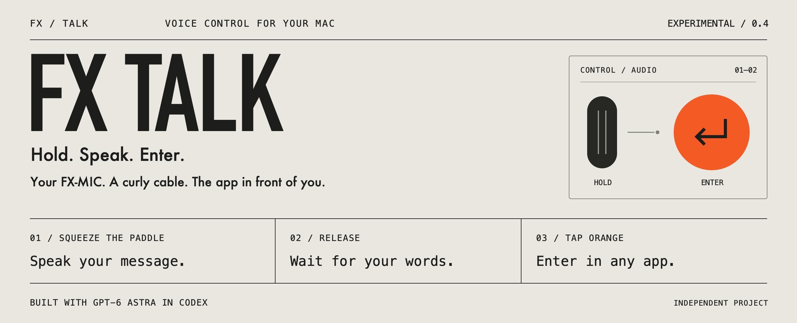

# FX Talk

**Hold. Speak. Enter.** Use a Teenage Engineering EP–2350 FX-MIC to dictate and press Enter on your Mac. Normal use needs just the curly audio cable and a USB audio input adapter.

Built with **GPT-6 Astra in Codex**, with product direction and physical testing by [Blake Graham](https://github.com/bjg4). Audio decoding and chirp generation are adapted from [Tingle](https://github.com/tutorintelligence/tingle).

**[Download v0.4.0](https://github.com/bjg4/fx-talk/releases/tag/v0.4.0)** · **[Setup guide](docs/TRANSFER-GUIDE.md)** · **[Tested hardware](#tested-hardware)** · **[Report an issue](https://github.com/bjg4/fx-talk/issues/new)**

## Get started

**Builder preview · Apple silicon · macOS 13+**

Experimental, with assisted setup. Developer ID-signed, not yet notarized. One hardware combination has been physically verified; see [compatibility](docs/COMPATIBILITY.md).<span data-proof="suggestion" data-id="m1788620001405_1" data-by="codex-blakeist-release" data-kind="insert">
Candidate 0.4.1 adopts the shared Blakeist release toolkit, with an audio-input entitlement for hardened signing, DMG and ZIP packages, checksums, and a required signing workflow. The existing 0.4.0 downloads remain unchanged. A public replacement still needs notarization and physical acceptance against the exact downloaded files; CI artifacts are internal builds. See release.config.json and the Prepare signed candidate workflow.</span>

| Your setup                           | Download                                                                                                                                           |
| ------------------------------------ | -------------------------------------------------------------------------------------------------------------------------------------------------- |
| First time, or preparing another mic | [Complete setup kit](https://github.com/bjg4/fx-talk/releases/download/v0.4.0/FX-Talk-0.4.0-Transfer-Kit.zip) — app, mic tools, guides, and source |
| Your mic is already prepared         | [Mac app](https://github.com/bjg4/fx-talk/releases/download/v0.4.0/FX-Talk-0.4.0-macOS-arm64.zip)                                                  |

1. Download the appropriate package and follow the [setup guide](docs/TRANSFER-GUIDE.md). A fresh mic needs a full backup and a one-time USB-C connection to install its signaling files.
2. Install your dictation app separately. Select the same audio adapter and hold shortcut in both apps. The tested setup uses **Monologue** with **Left Control + Left Option + D**.
3. Power the prepared mic with two AAA batteries, connect its curly audio cable through the adapter, and enable mic shortcuts in FX Talk. Once **Button signal locked** appears, you are ready.

## Use it

| Control                                                | Action                        |
| ------------------------------------------------------ | ----------------------------- |
| Hold the large squeeze paddle                          | Dictate                       |
| Release the paddle                                     | Finish dictation              |
| Tap the small top orange button after the words appear | Press Enter in the active app |

The active app decides what Enter does: send a message, run a terminal command, or insert a newline. White buttons are currently unmapped. After launching FX Talk or waking your Mac, enable mic shortcuts again.

FX Talk decodes button signals locally. Your separate dictation app handles recording and transcription. FX Talk does not save recordings, inspect draft text, or send network requests.

## Tested hardware

| Component     | Verified with v0.4.0                                                                                                                                                                                    |
| ------------- | ------------------------------------------------------------------------------------------------------------------------------------------------------------------------------------------------------- |
| Microphone    | [Teenage Engineering EP–2350 FX-MIC](https://teenage.engineering/store/ep-2350), EP series, firmware **1.0.9**. [Official guide](https://teenage.engineering/guides/ep-2350).                           |
| Audio adapter | [CableCreation](https://www.cablecreation.com/) **USB-C audio adapter**, purchased from Amazon. macOS name: **Cable Creation**; C-Media, **48 kHz mono input**. Exact retail model remains unconfirmed. |
| Mac           | **M4 MacBook Air · macOS 15.6.1**                                                                                                                                                                       |

```text
FX-MIC on AAA batteries → curly 3.5 mm cable → USB audio input adapter → Mac
```

The mic’s direct USB-C cable stays unplugged during normal use. The adapter link goes to the manufacturer until the exact Amazon listing is confirmed. Other adapters need an audio input that passes the control signals; see [adapter identification and compatibility](docs/COMPATIBILITY.md#tested-adapter-identification).

## Build and contribute

[Build instructions and source layout](docs/DEVELOPMENT.md) · [Architecture](docs/ARCHITECTURE.md) · [Roadmap](ROADMAP.md)

## Credits and license

[MIT-licensed](LICENSE). Tingle’s adapted chirp synthesis and matched-filter detector retain Copyright © 2026 Tutor Intelligence, Inc. and the [original MIT notice](ThirdParty/Tingle-LICENSE.txt). [Source provenance](NOTICE.md) records the upstream commit and FX Talk-specific additions.

FX Talk is an independent project, not affiliated with or endorsed by Teenage Engineering or OpenAI.

<!-- PROOF
{
  "version": 2,
  "marks": {
    "m1788620001405_1": {
      "kind": "insert",
      "by": "codex-blakeist-release",
      "createdAt": "2026-09-05T14:53:21.405Z",
      "range": {
        "from": 619,
        "to": 1053
      },
      "content": "\nCandidate 0.4.1 adopts the shared Blakeist release toolkit, with an audio-input entitlement for hardened signing, DMG and ZIP packages, checksums, and a required signing workflow. The existing 0.4.0 downloads remain unchanged. A public replacement still needs notarization and physical acceptance against the exact downloaded files; CI artifacts are internal builds. See release.config.json and the Prepare signed candidate workflow.",
      "status": "pending"
    }
  }
}
-->

<!-- PROOF:END -->
